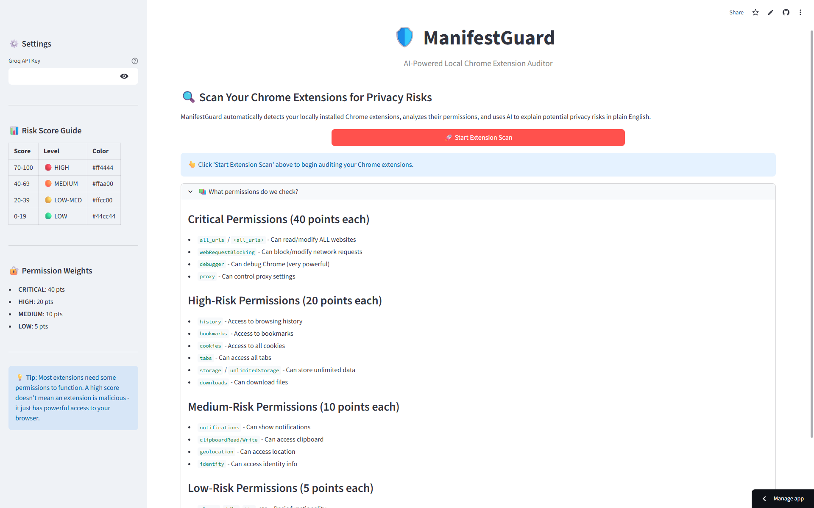

# 🛡️ ManifestGuard - AI-Powered Local Extension Auditor

> **"Know what your browser extensions know about you."**

[](https://www.python.org/downloads/)
[](https://streamlit.io/)
[](https://console.groq.com)
[](LICENSE)

---

## 📖 Overview

Most users don't realize that browser extensions like password managers, ad-blockers, or even simple productivity tools can technically **"read and change all your data"** on every website you visit. This powerful access is often necessary for functionality, but it also represents a significant privacy and security risk if misused.

**ManifestGuard** is a beginner-friendly, locally-run tool that:

- 🔍 **Automatically scans** your Chrome extensions directory
- 📊 **Calculates risk scores** based on permission severity
- 🤖 **Uses AI** to translate technical manifest files into human-readable security warnings
- 🔐 **Empowers you** to make informed decisions about your browser privacy

---

## 🌐 Live Demo

> **Note**: This tool scans **local** Chrome extensions on your machine, so a live demo has limited functionality. For full features, please run locally.

**Try it out**: [ManifestGuard Demo](https://manifestguard.streamlit.app/) 
<br>
<br>

To deploy your own instance:
- **Streamlit Cloud**: [](https://share.streamlit.io/)
- **Hugging Face Spaces**: Fork and deploy as a Streamlit Space
- **Docker**: `docker build -t manifestguard . && docker run -p 8501:8501 manifestguard`

---

## ✨ Features

| Feature | Description |
|---------|-------------|
| 🖥️ **Zero-Input Audit** | Automatically detects your OS (Windows/Mac/Linux) and scans installed Chrome extensions |
| 📈 **Risk Scoring** | Algorithm calculates a 0-100 safety score based on permission severity (CRITICAL/HIGH/MEDIUM/LOW) |
| 🤖 **AI Translation** | Converts technical manifest permissions into plain English using Llama 3.3 via Groq API |
| 📋 **Detailed Breakdown** | View all permissions, host access, and content script matches for each extension |
| 🔒 **Privacy-First** | All scanning happens locally; only permission names are sent to AI for analysis |
| 🎨 **Clean UI** | Intuitive Streamlit interface with color-coded risk indicators |

---

## 🚀 Quick Start

### Prerequisites

- Python 3.9 or higher
- A [Groq API key](https://console.groq.com) (free tier available)
- Chrome browser installed

### Installation

1. **Clone or download this repository:**
   ```bash
   git clone https://github.com/yourusername/manifestguard.git
   cd manifestguard
   ```

2. **Install dependencies:**
   ```bash
   pip install -r requirements.txt
   ```

3. **Run the application:**
   ```bash
   streamlit run app.py
   ```

4. **Enter your Groq API key** in the sidebar (get one free at [console.groq.com](https://console.groq.com))

5. **Click "Start Extension Scan"** and review your results!

---

## 📊 Risk Scoring System

ManifestGuard uses a weighted scoring system to calculate privacy risk:

| Level | Weight | Examples |
|-------|--------|----------|
| 🔴 **CRITICAL** | 40 points | `all_urls`, `webRequestBlocking`, `debugger`, `proxy` |
| 🟠 **HIGH** | 20 points | `history`, `bookmarks`, `cookies`, `tabs`, `storage` |
| 🟡 **MEDIUM** | 10 points | `notifications`, `clipboardRead`, `geolocation`, `identity` |
| 🟢 **LOW** | 5 points | `alarms`, `idle`, `tts`, `printerProvider` |

### Risk Score Interpretation

| Score | Level | Meaning |
|-------|-------|---------|
| 70-100 | 🔴 HIGH RISK | Extension has extensive access to your browser and data |
| 40-69 | 🟠 MEDIUM RISK | Significant permissions that could impact privacy |
| 20-39 | 🟡 LOW-MEDIUM RISK | Some permissions worth reviewing |
| 0-19 | 🟢 LOW RISK | Minimal permissions, generally safe |

---

## 🖥️ Supported Platforms

| OS | Chrome Path |
|----|-------------|
| **Windows** | `%LOCALAPPDATA%\Google\Chrome\User Data\Default\Extensions` |
| **macOS** | `~/Library/Application Support/Google/Chrome/Default/Extensions` |
| **Linux** | `~/.config/google-chrome/Default/Extensions` |

*Note: Also supports Chrome Beta, Dev, and Chromium variants.*

---

## 🏗️ Technical Details

### Architecture

```
┌─────────────────┐     ┌──────────────────┐     ┌───────────────── ┐
│   OS Detection  │───▶│  Extension Scan  │────▶│ Manifest Parser  │
└─────────────────┘     └──────────────────┘     └─────────────── ──┘
                                                           │
                           ┌───────────────────────────────┘
                           ▼
┌─────────────────┐     ┌──────────────────┐     ┌─────────────────┐
│   AI Analysis   │◀───│  Risk Calculator │◀────│ Permission Map  │
│   (Groq API)    │     │   (0-100 Score)  │     │ (Weighted pts)  │
└─────────────────┘     └──────────────────┘     └─────────────────┘
         │
         ▼
┌─────────────────┐
│  Streamlit UI   │
│ (Table + Detail)│
└─────────────────┘
```

### Tech Stack

- **Language**: Python 3.9+
- **Framework**: Streamlit
- **AI Model**: Llama 3.3 70B via Groq API (OpenAI-compatible)
- **Dependencies**: `openai`, `pandas`, `streamlit`, `pathlib`

---

## 🔮 Future Scope

### The "Cybersecurity Pro" Roadmap

| Feature | Description | Status |
|---------|-------------|--------|
| **Multi-Browser Support** | Extend to Edge, Brave, Opera (Chromium-based) | 🚧 Planned |
| **Behavioral Monitoring** | Analyze background scripts for suspicious network activity | 🔮 Future |
| **Alternative Suggestions** | Recommend privacy-focused alternatives for high-risk extensions | 🔮 Future |
| **Historical Tracking** | Track permission changes across extension updates | 🔮 Future |
| **Export Reports** | Generate PDF/JSON security audit reports | 🔮 Future |
| **Vulnerability DB** | Cross-reference with known malicious extension databases | 🔮 Future |

---

## 🤝 Contributing

Contributions are welcome! Areas where help is appreciated:

- 🌍 Additional browser support (Firefox, Safari)
- 🧪 Test coverage for different OS/Chrome configurations
- 📚 Improved permission classifications
- 🎨 UI/UX enhancements
- 🌐 Localization

---

## ⚠️ Disclaimer

**ManifestGuard is an educational tool.** A high risk score does **not** mean an extension is malicious—it simply indicates the extension has powerful permissions that *could* be misused. Many legitimate extensions (password managers, ad blockers, VPNs) require extensive permissions to function.

Always:
- Install extensions only from trusted sources (Chrome Web Store)
- Review permissions before installing
- Remove extensions you no longer use
- Keep extensions updated

---

## 📜 License

This project is licensed under the MIT License - see the [LICENSE](LICENSE) file for details.

---

## 🙏 Acknowledgments

- [Groq](https://groq.com) for providing fast, affordable LLM inference
- [Streamlit](https://streamlit.io) for the fantastic web app framework
- The Chrome team for maintaining clear extension documentation

---

## 📬 Contact

Have questions or suggestions? Open an issue or reach out!

**Happy (and safe) browsing!** 🌐🔒
