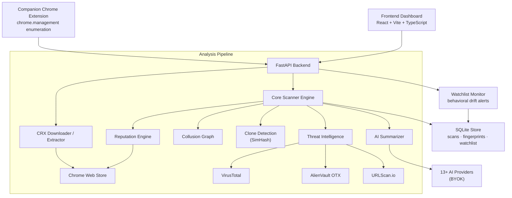

<div align="center">

```
 ███╗   ███╗ █████╗ ███╗   ██╗██╗███████╗███████╗ ██████╗████████╗
 ████╗ ████║██╔══██╗████╗  ██║██║██╔════╝██╔════╝██╔════╝╚══██╔══╝
 ██╔████╔██║███████║██╔██╗ ██║██║█████╗  █████╗  ╚█████╗    ██║
 ██║╚██╔╝██║██╔══██║██║╚██╗██║██║██╔══╝  ██╔══╝   ╚═══██╗   ██║
 ██║ ╚═╝ ██║██║  ██║██║ ╚████║██║██║     ███████╗██████╔╝   ██║
 ╚═╝     ╚═╝╚═╝  ╚═╝╚═╝  ╚═══╝╚═╝╚═╝     ╚══════╝╚═════╝    ╚═╝
              ██████╗ ██╗   ██╗ █████╗ ██████╗ ██████╗
             ██╔════╝ ██║   ██║██╔══██╗██╔══██╗██╔══██╗
             ██║  ██╗ ██║   ██║███████║██████╔╝██║  ██║
             ██║  ╚██╗██║   ██║██╔══██║██╔══██╗██║  ██║
             ╚██████╔╝╚██████╔╝██║  ██║██║  ██║██████╔╝
              ╚═════╝  ╚═════╝ ╚═╝  ╚═╝╚═╝  ╚═╝╚═════╝
```

### `> Evidence-Driven Extension Auditor_`

<br>


</div>

---

## Overview

Most extension scanners stop at **permissions**. That creates noise — security tools, password managers, and developer extensions often need broad access to do legitimate work.

**ManifestGuard** goes deeper with multi-layered extension security analysis — separating legitimate *reach* from actual *malice* using deep behavioral analysis, CRX source-code inspection, publisher reputation scoring, cross-extension collusion detection, repackaged-clone detection, threat intelligence, and AI-powered summaries.

It ships as a complete, end-to-end platform: a **companion Chrome extension** enumerates your installed extensions and sends their metadata to a **FastAPI analysis backend**, which downloads and statically analyzes each extension's real source code, then presents an evidence-driven **React dashboard** — including an interactive collusion graph and a continuous-monitoring watchlist.

```diff
+ One-click companion extension ("an extension that audits your extensions")
+ Deep CRX source-code analysis (downloads & extracts extension packages)
+ Cross-extension collusion detection (shared C2 + externally_connectable)
+ Repackaged-clone detection (SimHash near-duplicate matching)
+ Continuous monitoring watchlist (alerts on behavioral drift between versions)
+ CWS Reputation Engine (0-100 scores based on users, ratings, badges)
+ Threat Intelligence (VirusTotal, AlienVault OTX, URLScan integration)
+ AI Security Summaries (BYOK: 13+ providers supported)
+ Measured detection accuracy against a labeled dataset (see below)
- "all high permissions = malware"
- noisy false positives on popular trusted tools
```

---

## Detection Accuracy

These numbers come from `evaluation/run_evaluation.py` running the **full live pipeline** (real CRX downloads + static analysis) against a labeled dataset of known-malicious and popular-safe extension IDs. Re-run it yourself with `python -m evaluation.run_evaluation --live --write-readme`.

<!-- METRICS:START -->
### Detection Accuracy — live evaluation

Evaluated on **23 / 63** labeled extensions (rest were delisted/unreachable at run time).

| Metric | Score |
|:-------|:------|
| Precision | **70.0%** |
| Recall (detection rate) | **100.0%** |
| F1 score | **82.4%** |
| Accuracy | **87.0%** |
| False-positive rate | **18.8%** |

Confusion matrix (positive = malicious): TP=7, FP=3, TN=13, FN=0.
<!-- METRICS:END -->

> Note: many known-malicious IDs have been removed from the Chrome Web Store, so a live run only scores the subset that still resolves. **Recall of 100%** means every reachable malicious sample was caught; the false positives are aggressive-permission "safe" extensions — an honest illustration of the precision/recall tradeoff the verdict ladder is tuned around.

---

## Features

| Feature | Detail |
|:--------|:-------|
| 🧭 **Tiered Verdicts** | `trusted`, `low_concern`, `moderate_risk`, `suspicious`, `known_malicious` |
| 🧠 **Multi-Dimensional Scoring** | `powerScore` (reach), `suspicionScore` (behavior), `reputationScore` (trust) |
| 📦 **Deep Source Analysis** | Downloads CRX packages from Google, strips protobuf headers, extracts & analyzes source code in memory |
| 🌐 **Threat Intelligence** | Live domain scanning via VirusTotal, AlienVault OTX, and URLScan APIs |
| 🤖 **AI Analysis** | Security summaries, risk explanations, and interactive chat with 13+ AI providers (BYOK) |
| 🛡️ **Safe Recommendations** | Suggests trusted alternatives from a curated 200+ extension allowlist |
| 📊 **Rich Reports** | Export as CSV, JSON, HTML, or zero-dependency PDF |
| 🔒 **Security Hardened** | Input validation, SSRF protection, path traversal prevention, no hardcoded secrets |

---

## Architecture



### Backend Modules

| Module | Purpose |
|:-------|:--------|
| `api.py` | REST routes — scans, extensions, chat, reports, watchlist, stats, AI settings |
| `service.py` | Scan orchestration, watchlist monitoring, thread-safe scan registry |
| `database.py` | SQLite persistence — scans, code fingerprints, watchlist + baselines; legacy JSON migration |
| `scanner.py` | Core classification — reach score, anomaly score, verdict assignment |
| `crx_analyzer.py` | CRX download, protobuf header stripping, in-memory ZIP extraction |
| `similarity.py` | Repackaged-clone detection via SimHash over JS token shingles |
| `collusion.py` | Cross-extension collusion graph (shared C2 + `externally_connectable`) |
| `reputation.py` | CWS scraping → user counts, ratings, badges → 0-100 reputation score |
| `recommendations.py` | Category inference + safe alternative matching |
| `allowlist.py` | 205+ curated trusted extensions database |
| `ai.py` | Multi-provider AI client (13+ providers), summaries, chat, connection testing |
| `intel.py` | Threat intelligence aggregation (VT, OTX, URLScan) |
| `reports.py` | Zero-dependency PDF, HTML, CSV, JSON report generation |
| `models.py` | Strict dataclass validation for all inputs/outputs |

---

## AI Provider Support (BYOK)

ManifestGuard supports **Bring Your Own API Key** with 13+ providers. Keys are stored client-side only (localStorage) and sent as request headers — never persisted on the server.

| Provider | Free Tier | Default Model |
|----------|:---------:|---------------|
| ⚡ Groq | ✅ | llama-3.3-70b-versatile |
| 💎 Google Gemini | ✅ | gemini-2.0-flash |
| 🤗 Hugging Face | ✅ | Llama-3.3-70B-Instruct |
| 🧠 Cerebras | ✅ | llama-3.3-70b |
| 🚀 SambaNova | ✅ | Meta-Llama-3.3-70B-Instruct |
| ☁️ Cloudflare Workers AI | ✅ | @cf/meta/llama-3.3-70b-instruct-fp8-fast |
| 🤖 OpenAI | ❌ | gpt-4o-mini |
| 🔀 OpenRouter | ❌ | llama-3.3-70b-instruct |
| 🤝 Together AI | ❌ | Llama-3.3-70B-Instruct-Turbo |
| 🌊 Mistral AI | ❌ | mistral-large-latest |
| 🔍 DeepSeek | ❌ | deepseek-chat |
| 𝕏 xAI (Grok) | ❌ | grok-3-mini-fast |
| 🔧 Custom | — | Any OpenAI-compatible endpoint |

---

## Detection Engine

### Classification Strategy

```
POWER SCORE        → "How much browser/data access does this extension have?"
REPUTATION SCORE   → "How trusted is this publisher in the Chrome Web Store?"
SUSPICION SCORE    → "Does the code contain indicators of compromise?" (adjusted by reputation)
THREAT INTEL       → "Do any contacted domains appear in threat databases?"
AI ANALYSIS        → "What does an LLM think about the combined evidence?"
VERDICT            → Final deterministic classification
```

### Suspicious Signals

```
[01] Remote config / heartbeat fetching
[02] Remote script injection into page context
[03] CSP or header tampering patterns
[04] Heavy obfuscation / eval / Function usage
[05] Broad host access + cookie/session-sensitive permissions
[06] Purpose-permission mismatch
[07] Potential cryptocurrency mining
[08] Clipboard tampering / credential harvesting
[09] Screen capture / keylogging capabilities
[10] Collusion patterns between extensions
```

---

## Quick Start

### Requirements

- Python 3.10+
- Node.js 18+ / npm
- Optional: AI API key for summaries (6 free-tier providers available)
- Optional: Threat intel API keys (VirusTotal, AlienVault OTX, URLScan)

### Setup

```bash
# Clone
git clone https://github.com/your-username/ManifestGuard.git
cd ManifestGuard

# Backend
pip install -r requirements.txt
cp backend/.env.example backend/.env   # Fill in your API keys
python -m backend.serve

# Frontend (new terminal)
cd frontend
npm install
npm run dev
```

### Default Ports

```
API      → http://127.0.0.1:8000
Web UI   → http://127.0.0.1:5173
```

### Windows Shortcuts

```powershell
.\start-backend.ps1      # Start backend
.\start-dev.ps1           # Start both backend + frontend
.\start-dev.ps1 -Detached # Run in background
```

---

## Companion Chrome Extension

The `extension/` directory contains a Manifest V3 companion extension that closes the loop — *an extension that audits your extensions*.

1. Click the toolbar icon → **Audit my extensions**
2. It enumerates installed extensions via the `chrome.management` API (no code injection, read-only)
3. It POSTs their metadata to `/api/scans/online`
4. It opens the dashboard deep-linked to the fresh report (`?scan=<id>`)

**Load it locally:** `chrome://extensions` → enable *Developer mode* → *Load unpacked* → select the `extension/` folder. Set your backend URL from the popup's settings. See `extension/README.md` for details.

---

## Continuous Monitoring (Watchlist)

Extension supply-chain attacks usually arrive through an **update** to an already-trusted extension (e.g. the real "Great Suspender" incident). ManifestGuard's watchlist re-analyzes tracked extensions and raises alerts on behavioral drift:

- New permissions requested between versions
- New network domains contacted
- Obfuscation newly introduced
- Risk verdict escalation

Baselines and alerts are persisted in SQLite so drift is detected across restarts.

---

## Use Cases

| Audience | Use Case |
|:---------|:---------|
| **Enterprise IT / SOC** | Audit employee browser extension fleets for risk and policy violations |
| **Individuals** | Vet an extension before installing it, or clean up an existing browser |
| **Security researchers** | Triage extension malware campaigns; detect clones and collusion clusters |
| **Extension developers** | Pre-publish self-audit to understand how a scanner perceives your code |

---

## API Routes

```
GET    /api/health                                          Health check
POST   /api/scans/online                                    Scan extensions (from companion)
POST   /api/scans/single                                    Scan single extension by ID
POST   /api/scans/local                                     Scan locally installed extensions
GET    /api/scans                                           List all scans
GET    /api/scans/{scanId}                                  Get scan detail
GET    /api/scans/{scanId}/extensions                       List extensions in scan
GET    /api/scans/{scanId}/extensions/{extId}               Extension detail
POST   /api/scans/{scanId}/extensions/{extId}/chat          Chat with AI about extension
GET    /api/scans/{scanId}/extensions/{extId}/recommendations  Safe alternatives
GET    /api/scans/{scanId}/reports/{format}                 Export report (csv/json/html/pdf)
GET    /api/watchlist                                       List watched extensions
POST   /api/watchlist                                       Add extension to watchlist
DELETE /api/watchlist/{extId}                               Remove from watchlist
POST   /api/watchlist/{extId}/check                         Re-scan and diff for drift
POST   /api/watchlist/check-all                             Re-scan every watched extension
GET    /api/stats                                           Aggregate scan stats
POST   /api/settings/ai/test                                Test AI provider connection
GET    /api/settings/ai/providers                           List available AI providers
```

---

## Report Formats

| Format | Description |
|:-------|:------------|
| CSV | Flat extension inventory spreadsheet |
| JSON | Full structured evidence export |
| HTML | Shareable styled audit report |
| PDF | Zero-dependency printable summary |

Reports are stored in `backend/data/{scanId}/`.

---

## Environment Variables

```bash
# AI Provider (choose one, or configure via UI)
GROQ_API_KEY=                    # Groq (recommended — fast & free)
OPENAI_API_KEY=                  # OpenAI
MANIFESTGUARD_AI_API_KEY=        # Custom OpenAI-compatible endpoint
MANIFESTGUARD_AI_BASE_URL=       # Custom endpoint URL
MANIFESTGUARD_AI_MODEL=          # Custom model name

# Threat Intelligence (all optional)
VIRUSTOTAL_API_KEY=              # VirusTotal domain lookups
ALIENVAULT_OTX_KEY=              # AlienVault OTX pulse checks
URLSCAN_API_KEY=                 # URLScan.io submissions

# Server
ALLOWED_ORIGINS=http://localhost:5173,chrome-extension://your-id
```

---

## Security

ManifestGuard has been hardened against common attack vectors:

- **Input validation** on all user-controlled inputs (scan IDs, extension IDs, chat messages)
- **SSRF protection** — URL allowlisting for CRX downloads (only `clients2.google.com`)
- **Path traversal prevention** — Zip Slip protection during CRX extraction
- **Thread-safe state** — Lock-based scan registry prevents race conditions
- **No hardcoded secrets** — All keys via environment variables or client-side BYOK
- **CORS restricted** — Only configured origins allowed
- **AI keys never stored server-side** — BYOK keys are sent per-request via headers

---

## Disclaimer

```
ManifestGuard is an audit and triage tool.

It is designed to reduce false positives, not eliminate judgment.
A verdict of "low_concern" means the extension has broad reach but
currently lacks stronger malicious evidence.

Always review:
  → source trust
  → publisher reputation
  → store status
  → whether you still need the extension
```

---

<div align="center">

**Your browser is only as safe as the extensions you keep.**

</div>
